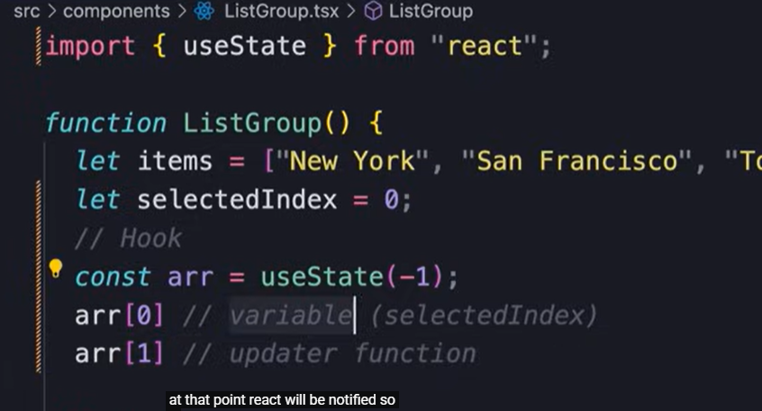
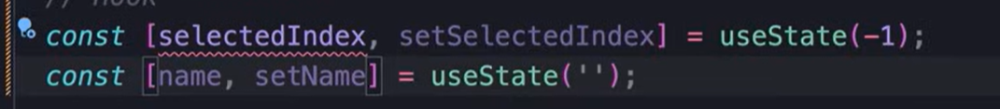
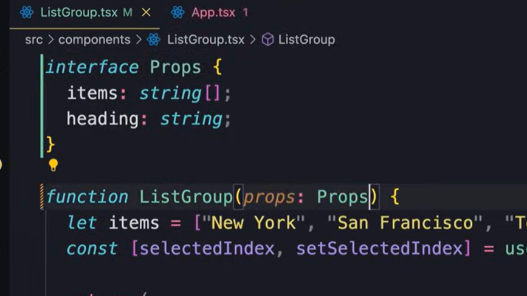
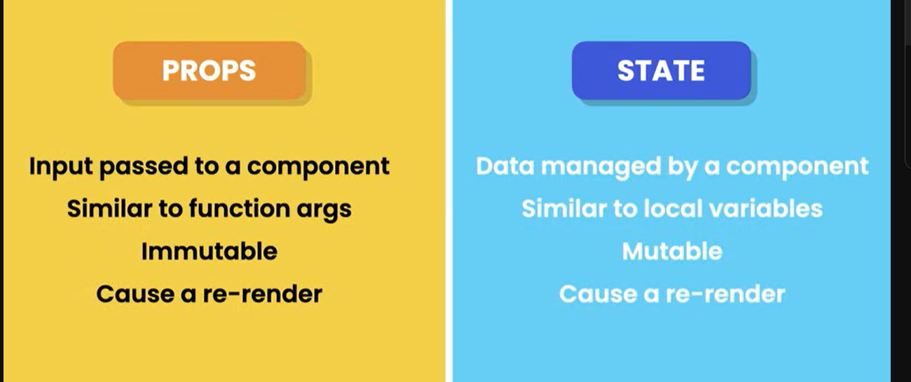

# React:
- Is a JS library for building dynamic and interactive UIs
- currently mostly used front-end development 
- When a webpage is loaded, browser takes the HTML code and converts it into tree like structure called DOM
- This allows us to use Javascript and change page content
- We can use plain java script(vanilla js), with this it will be quite complex to manage
- Using React we can write small reusable components, then react will take care of creating and updating DOM.
- Components help us to write reusable, managable and better organized code.
- App is the root component, we can create more components
-  Vite+React then Next+React
- ### Project Structure:
1. Index.html - Entry point of our application
2. Package.json - dependencies, title and packages etc
- For react componenets the extensions is tsx -> TS + TSX(HTML like structure means "const element = <h1>Hello World</h1>;") 
- Most react developers are using Pascal case(always first letter starts with Captial letter)
- JSX -> Js + XML
- Vite under the hood always monitors the code, when ever we make any change in the code it will automatically refresh the page and updates the DOM.
- ### How React works:
- With the Componenets we have in the prj, React creates a Virtual DOM which is diff from actual DOM
- It creates VDOM with the componenst, each component as a node in VDOM
- When we make a change in the React component, it will updates the corresponding node in the VDOM.
- Then it compares with the actual browser DOM and updates those nodes only in actual DOM.
- ### React Eco System:
- React - Library -  like a tool
- Angular and Vue - Frame work- like a tool set
- Diff b/w Library and Frame work:
-  
- ### Building Components:
- The react component can only return one element
- So instead of adding a new element to wrap everything we can use some thing called Fragment which is an Fragment tags(<Fragment><Fragment/>), this tag will not be added into the DOM.
- Instead of Fragment we can also use an EMPTY tags means a fragment only
- #### Rendering Lists:
- 
- If we wanted to dynamically add the data in component, we can use js right but we need to wrap it in {} braces in JSX.
- In a list or any items or tags, react needs a unique key to keep track of the element 
- 
- We can add a unique Key like above
- ###### Conditional Rendering:
- 
- 
- We can use conditional 'AND' for conditional rendering.
- #### Handling Events:
- 


----------------------------------------------------------------
- Componenets: Building blocks of every react app and they are reusable
- 
- Every components is Js function that returns markup(means Js + XML)
- They don't return HTML markup, return JSX markup means 
- JSX stands for JavaScript XML.
- Js fn retuns one thing
- 
- ### To pass Data to other elements:
- using Prop we can pass the data to another component.
- 
- ### Renering on Webpage:
- React uses Virtual DOM (VDOM) for rendering
- DOM: Document Object MOdel
- 
- 
- ### Managing state:
- When we have any var/data that changes, we need to tell react that this component will have data/var that changes over time
- To tell that we will use a buil in fn called "useState", this is also called as hook.
- This useState returns an array and we will have var at 0 th index and fn at 1st index
- 
- 
- useState is a hook which has 2 things- var and a fn
- When we pass any value to the fn that value will be going to store in the that par var.
- ### Passing Data via Props:
```tsx
import { useState } from "react";
let List = ['a', 'b', 'c', 'd'];
//List = [];
// const handleClick = (event: MouseEvent) => console.log(event);
//let selectedIndex = -1;

function ListGroup() 
{
    const [selectedIndex, setSelectedIndex] = useState(-1);
    return <>
        <h1>ListGroup</h1>
        {List.length === 0 && <p>No items found</p>}
        <ul className="list-group">
            {List.map((item, index) => (<li
                className={selectedIndex === index ? "list-group-item active" : "list-group-item"}
                key={item}
                // onClick={handleClick}
                onClick={() => { setSelectedIndex(index); }}>
                {item}
            </li>))}
        </ul>
    </>
}

export default ListGroup;
```
- Here If we want to have a list of names instead of cities, we should not create a new list right.
- So to make it dynamic we have to pass the data similarly like a fn.
- In the above code we can pass the heading and items instead of hard coding them
- So to do that we use interface, like below
- 
```tsx
import { useState } from "react";
//List = [];
// const handleClick = (event: MouseEvent) => console.log(event);
//let selectedIndex = -1;
interface ListGroupProps {
    items: string[];
    heading: string;
}

function ListGroup(ListGroupProps: ListGroupProps) {
    const [selectedIndex, setSelectedIndex] = useState(-1);
    return <>
        <h1>ListGroup</h1>
        {ListGroupProps.items.length === 0 && <p>No items found</p>}
        <ul className="list-group">
            {ListGroupProps.items.map((item, index) => (<li
                className={selectedIndex === index ? "list-group-item active" : "list-group-item"}
                key={item}
                // onClick={handleClick}
                onClick={() => { setSelectedIndex(index); }}>
                {item}
            </li>))}
        </ul>
    </>
}

export default ListGroup;

----------------------------------------------
App.tsx:

import Message from "./Message"
import ListGroup from "./Components/ListGroup"
function App() {
  let items = ['a', 'b', 'c', 'd'];
  return <div><ListGroup items={items} heading="ListGroup" /></div>
}
export default App

```

- ### Passing fns via proprs:
- If any change happened or  anything is selected in child component then we want to notify the parent comp means we can use these method
- need to defined a fn in child class and when a click happened we call that fn
```tsx
import { useState } from "react";
//List = [];
// const handleClick = (event: MouseEvent) => console.log(event);
//let selectedIndex = -1;
interface ListGroupProps {
    items: string[];
    heading: string;
    onSelectItem: (item: string) => void;
}

function ListGroup({ items, heading, onSelectItem }: ListGroupProps) {
    const [selectedIndex, setSelectedIndex] = useState(-1);
    return <>
        <h1>{heading}</h1>
        {items.length === 0 && <p>No items found</p>}
        <ul className="list-group">
            {items.map((item, index) => (<li
                className={selectedIndex === index ? "list-group-item active" : "list-group-item"}
                key={item}
                // onClick={handleClick}
                onClick={() => {
                    setSelectedIndex(index);
                    onSelectItem(item);
                }}>
                {item}
            </li>))}
        </ul>
    </>
}

export default ListGroup;


-----------------------
import Message from "./Message"
import ListGroup from "./Components/ListGroup"
function App() {
  let items = ['a', 'b', 'c', 'd'];
  const onSelectedItem=(items:string)=>console.log(items);
  return <div><ListGroup items={items} heading="Alphabets"  onSelectItem={onSelectedItem}/></div>
}
export default App
```

- ### State vs Prop:
- 
- ### Passing children:
- We can pass data from one component to another through props but we need to send it like below:
```jsx
interface AlertProps {
    text: string
}
const Alertfn = () => { console.log("Alert function called"); }
const Alert = ({ text }: AlertProps) => {
    return (
        <div className="alert alert-primary" role="alert" onClick={Alertfn}>
            {text}
        </div>);
}
export default Alert;
///////////////////////////////////////////////////
import Message from "./Message"
import ListGroup from "./Components/ListGroup"
import Alert from "./Components/Alert"
function App() {
  let items = ['a', 'b', 'c', 'd'];
  const onSelectedItem = (items: string) => console.log(items);
  const text = "Hello! This is an alert message.";
  return <div>
    {/* <ListGroup items={items} heading="Alphabets" onSelectItem={onSelectedItem} /> */}
    <Alert text={text} />
  </div>
}
export default App

```
- SO instead like  below we can directly send using childern
```jsx
 return <div>
    {/* <ListGroup items={items} heading="Alphabets" onSelectItem={onSelectedItem} /> */}
    <Alert text={text} />
  </div>
```
- To pass using children:
```tsx
interface AlertProps {
    children: string
}
const Alertfn = () => { console.log("Alert function called"); }
const Alert = ({ children }: AlertProps) => {
    return (
        <div className="alert alert-primary" role="alert" onClick={Alertfn}>
            {children}
        </div>);
}
export default Alert;
/////////////////////////////////////////////

import Message from "./Message"
import ListGroup from "./Components/ListGroup"
import Alert from "./Components/Alert"
function App() {
  let items = ['a', 'b', 'c', 'd'];
  const onSelectedItem = (items: string) => console.log(items);
  const text = "Hello! This is an alert message.";
  return <div>
    {/* <ListGroup items={items} heading="Alphabets" onSelectItem={onSelectedItem} /> */}
    <Alert>Hello world!</Alert>
  </div>
}
export default App
```
- If we want to send like a html/markup code using children then we have to define the type of children to ReactNode
- like below:
```tsx
interface AlertProps {
    children: ReactNode
}
```
- React dev tools- for inspecting the react components
- creating button component
```tsx
import Message from "./Message"
import ListGroup from "./Components/ListGroup"
import Alert from "./Components/Alert"
import Button from "./Components/Button";
function App() {
  let items = ['a', 'b', 'c', 'd'];
  const onSelectedItem = (items: string) => console.log(items);
  const text = "Hello! This is an alert message.";
  const handleButtonClick = () => {
    console.log("Button clicked!");
  }
  return <div>
    {/* <ListGroup items={items} heading="Alphabets" onSelectItem={onSelectedItem} /> */}
    {/* <Alert>Hello world!</Alert> */}
    <Button children="MyButton" onClick={handleButtonClick} color="success" />
  </div>
}
export default App
///////////////////////////////
import type { ReactNode } from "react";

interface ButtonProps {
    children: ReactNode;
    color: string;
    onClick: () => void;
}
const Button = ({ children, onClick, color }: ButtonProps) => {
    return <button type="button" className={'btn btn-' + color} onClick={onClick}>
        Primary
    </button>
}
export default Button;
```
- If we want to set the color to only few colors and dont want any other, then
```tsx
interface ButtonProps {
    children: ReactNode;
    color: "primary" | "secondary" | "success" | "danger" | "warning" | "info" | "light" | "dark";
    onClick: () => void;
}
```
- Task:
- When we click on button, should show alert and when we click on close symbol of button the alert should dissapear
```tsx
import Message from "./Message"
import ListGroup from "./Components/ListGroup"
import Alert from "./Components/Alert"
import Button from "./Components/Button";
import { useState } from "react";
function App() {
  const [alertVisible, setAlertVisible] = useState(false);
  let items = ['a', 'b', 'c', 'd'];
  const onSelectedItem = (items: string) => console.log(items);
  const text = "Hello! This is an alert message.";
  const handleButtonClick = () => {
    console.log("Button clicked!");
    setAlertVisible(true);
  }
  const handleAlertClose = () => {
    setAlertVisible(false);
  }
  return <div>
    {/* <ListGroup items={items} heading="Alphabets" onSelectItem={onSelectedItem} /> */}
    {alertVisible && <Alert onCloseClick={handleAlertClose}>'Hello World!'</Alert>}
    <Button children="MyButton" onClick={handleButtonClick} color="success" />
  </div>
}
export default App
///////////////////////////////////////
import type { ReactNode } from "react";

interface ButtonProps {
    children: ReactNode;
    color: "primary" | "secondary" | "success" | "danger" | "warning" | "info" | "light" | "dark";
    onClick: () => void;
}
const Button = ({ children, onClick, color }: ButtonProps) => {
    return <button type="button" className={'btn btn-' + color} onClick={onClick}>
        {children}
    </button>
}
export default Button;

/////////////////////////////////////////

import type { ReactNode } from "react";

interface AlertProps {
    children: ReactNode;
    onCloseClick: () => void;
}
const Alertfn = () => { console.log("Alert function called"); }
const Alert = ({ children, onCloseClick }: AlertProps) => {
    return (
        // <div className="alert alert-primary" role="alert" onClick={Alertfn}>
        //     {children}
        // </div>
        <div className="alert alert-primary" role="alert">
            {children}
            <button type="button" className="btn-close" data-bs-dismiss="alert" aria-label="Close" onClick={onCloseClick}></button>
        </div>
    );
}
export default Alert;
```


---------------------------------------------------------
- ## Folder structure
app/
  layout.tsx             ← Root layout, wraps the whole app (all pages)
  page.tsx               ← Homepage `/`
  about/
    page.tsx             ← About page `/about`
  projects/
    layout.tsx           ← Layout specific to `/projects` route and its children
    page.tsx             ← Projects page `/projects`


- 1. app/layout.tsx — Root Layout

This is the main wrapper for your entire website.

Anything you put here (like a header, footer, or global styles) will appear on every page of your website.

It’s like the outer frame holding all your pages inside.

Think of it like the main skeleton of your website.


------------------------------------------------------------------
# 👩‍💻 Full-Stack Developer

## 🌟 About Me

I’m a passionate **Full-Stack Developer** with a strong foundation in both **frontend and backend development**, focused on building scalable, user-friendly, and reliable web applications.

I enjoy turning real-world problems into clean, efficient solutions using modern JavaScript frameworks and backend technologies. I’m especially interested in building end-to-end products, working with APIs, and continuously learning new tools that improve performance, security, and user experience.

I’m excited to collaborate on impactful projects and grow as a software engineer in a fast-paced, product-driven environment.

---

## 🛠️ Technical Skills

### 💻 Languages
- JavaScript  
- TypeScript  
- HTML  
- CSS  
- SQL  

### ⚙️ Frameworks & Libraries
- React.js  
- Next.js  
- Angular  
- Node.js  
- NestJS  

### 🗄️ Databases
- MongoDB  
- DynamoDB  
- PostgreSQL  

### 🧰 Tools & Platforms
- Git & GitHub  
- Postman  
- Swagger  
- Jest (Unit Testing)  

**Focus Areas:** Full-Stack Development, REST APIs, Authentication & Authorization, Clean Code, Testing

---

## 📌 Projects

### 🔹 Credit Underwriting Platform (CUP)
**Tech Stack:** NestJS, MongoDB  
**Type:** Training / Enterprise-style Project  

**Description:**  
A backend-focused platform built to support administrative workflows and secure financial operations.

**Key Contributions:**
- Designed and developed APIs to retrieve and download admin lists with filtering capabilities  
- Implemented OTP-based verification with validation, lockout conditions, and mobile verification checks  
- Fixed wallet-related issues including balance calculation, sorting, formatting, and paisa-to-rupee conversion  
- Wrote and executed unit tests using Jest, covering both positive and negative scenarios  
- Improved code quality and ensured secure user access  

---

### 🎬 Movie Ticket Booking Website
**Tech Stack:** Angular, Node.js  

**Description:**  
A full-stack movie ticket booking application with role-based access for admins and users.

**Key Features:**
- Separate admin and user modules  
- Authentication and authorization system  
- Movie management and booking functionality  
- Clean UI with structured workflows  

---

### 📝 Quiz Website
**Tech Stack:** React.js, Node.js  
**Type:** Training Project  

**Description:**  
An interactive quiz platform designed to evaluate users and display results in real time.

**Key Features:**
- Users can select one answer per question  
- Displays score with correct answers  
- Integrated scoring logic and leaderboard system  

---

### 🍽️ Recipe Cookbook Website
**Tech Stack:** Angular  
**Type:** Training Project  

**Description:**  
A recipe management platform for browsing and managing cooking recipes.

**Key Features:**
- Recipe categorization with detailed ingredients and instructions  
- Users can add, edit, and manage their own recipes  
- Clean and user-friendly interface  


---

## ✨ Tagline Ideas
- **Full-Stack Developer building scalable web applications with modern JavaScript**
- **Turning ideas into clean, reliable, and user-focused web solutions**
- **Full-Stack Developer | React | Angular | Node.js | NestJS**
